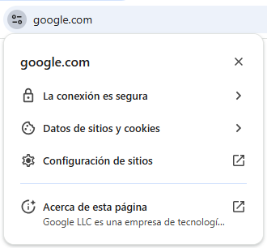
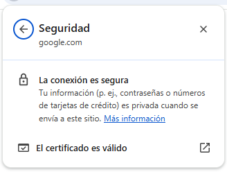
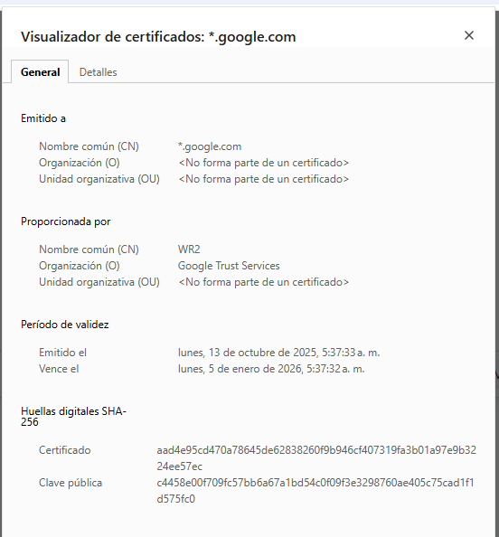
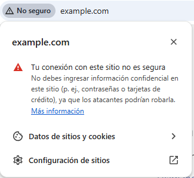
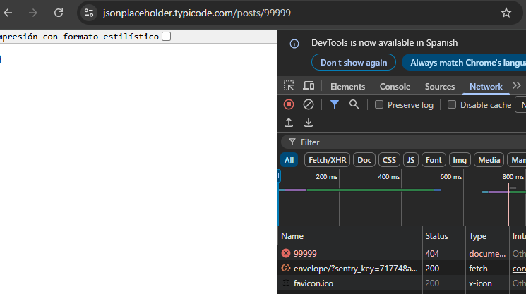
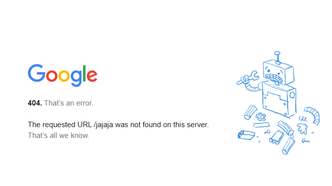

# 🌐 Desafío de investigacion - Protocolo HTTP y APIs Web

👤 **Nombre:** Héctor Chacón

🎓 **Cohorte:** Java Full Stack Cohorte 22  

---

## 🎯 Objetivo General

Investigar y comprender los fundamentos del **protocolo HTTP** y su rol dentro del funcionamiento de las **APIs web**.

El propósito es poder explicar con palabras propias cómo los **navegadores, servidores y APIs** se comunican a través de este protocolo.

---
 Cada vez que accedemos a una página web, nuestro navegador realiza una serie de pasos invisibles que permiten comunicarse con el servidor donde se aloja el sitio. Este proceso ocurre mediante el protocolo HTTP (HyperText Transfer Protocol), que define cómo se envían y reciben los mensajes en la web.

1️⃣ Cuando escribimos una dirección como http://ejemplo.com/pagina.html, el navegador traduce el dominio (por ejemplo, ejemplo.com) a una dirección IP usando el servicio DNS. Esto permite saber en qué servidor se encuentra la página.

2️⃣ Establece una conexión TCP con el servidor a través del puerto 80, que es el estándar para HTTP.

3️⃣ Construye una petición HTTP, que incluye:

* El método (por ejemplo, GET /pagina.html).

* El protocolo (HTTP/1.1 o HTTP/2).

* Los encabezados (User-Agent, Host, etc.).

* (Opcional) un cuerpo de mensaje si es una solicitud POST.

4️⃣ Envía la petición como texto plano al servidor.

🔓 Cualquier punto intermedio (router, proxy, ISP) podría leer el contenido.

5️⃣ El servidor recibe la petición, la interpreta y responde con un mensaje HTTP, que contiene:

* El código de estado (200 OK, 404 Not Found, etc.).

* Los encabezados de respuesta.

* El cuerpo con el contenido solicitado (HTML, JSON, imágenes, etc.).

6️⃣ El navegador recibe la respuesta, procesa el contenido (por ejemplo, el HTML y los recursos asociados)
y renderiza la página web para mostrarla al usuario.


---

## 🔹 1. Diferencia entre HTTP y HTTPS

### 📘 Significado
- **HTTP**: *HyperText Transfer Protocol*  
  Es el protocolo estándar para la comunicación entre navegadores y servidores web.  
  La información viaja en texto plano, sin cifrar.

- **HTTPS**: *HyperText Transfer Protocol Secure*  
  Es la versión segura de HTTP. Utiliza **SSL/TLS** para cifrar la información que viaja entre el cliente y el servidor.

### 🔐 Cifrado SSL/TLS
Cuando un sitio usa HTTPS, se establece una conexión cifrada:
1. El navegador solicita una conexión segura.
2. El servidor envía su **certificado digital**.
3. Si el certificado es válido, ambos crean una **clave compartida cifrada**.
4. A partir de ese momento, toda la comunicación viaja protegida.

Esto evita que terceros puedan leer o modificar los datos.

### 🔐 Secuencia de una petición HTTPS 

1️⃣ El navegador traduce el dominio (ejemplo.com) a una IP (DNS). 

2️⃣ Establece la conexión TCP, pero ahora en el puerto 443. 

3️⃣ Inicia el “handshake” TLS, donde: 
* Se autentican el cliente y el servidor. 
* Se negocia el método de cifrado. 
* Se intercambian claves seguras. 

4️⃣ Una vez cifrada la conexión, se envía la petición HTTP (por ejemplo, GET /pagina.html), pero de forma encriptada. 

5️⃣ El servidor desencripta, procesa la solicitud y responde cifrado. 

6️⃣ El navegador desencripta la respuesta y muestra el contenido.


### ✅ Ejemplo
En la barra de direcciones de un navegador, el **candado cerrado 🔒** indica que el sitio usa HTTPS.







`https://www.google.cl` → 🔒 Conexión segura 



`http://www.example.com` → ⚠️ Conexión no cifrada

### ⚠️ ¿Qué sucede si un sitio no usa HTTPS?
- Los datos (contraseñas, formularios, etc.) pueden ser interceptados.
- Los navegadores muestran advertencias de seguridad.
- Los motores de búsqueda penalizan sitios sin HTTPS.

### 🧪 Ejemplo práctico con `curl`
```bash
curl -I http://www.google.cl:80
```
📤 Resultado (resumido):
```
HTTP/1.1 200 OK
Content-Type: text/html; charset=ISO-8859-1
Server: gws
```
Esto confirma que Google responde en el **puerto 80 (HTTP)**.  

➡️ Google responde “200 OK” en HTTP como una página mínima, pero no permite que el usuario permanezca ni navegue sin HTTPS.
Es una forma avanzada de compatibilidad con viejas solicitudes o bots, manteniendo la seguridad moderna.

Si probamos con HTTPS:
```bash
curl -I https://www.google.cl:443
```
El resultado incluirá:
```
HTTP/1.1 200 OK
Content-Type: text/html; charset=ISO-8859-1
Strict-Transport-Security: max-age=31536000; includeSubDomains
```
➡️ Indica que la conexión es **segura** y forzada a HTTPS.

---

## 🔹 2. Puertos de comunicación

### 📘 ¿Qué es un puerto?
En redes, un **puerto** es un número que identifica el canal por el que viaja la información entre un cliente y un servidor.  
Cada protocolo (HTTP, FTP, SSH, etc.) usa su propio puerto.

### 🔢 Puertos más usados
| Puerto | Protocolo | Uso principal |
|---------|------------|---------------|
| **80** | HTTP | Tráfico web no cifrado |
| **443** | HTTPS | Tráfico web cifrado |
| **21** | FTP | Transferencia de archivos |
| **22** | SSH | Acceso remoto seguro |
| **25** | SMTP | Envío de correos |
| **3306** | MySQL | Base de datos MySQL |
| **8080** | HTTP alternativo | Servidores locales o pruebas |

### 💡 Ejemplo
- `http://www.google.cl:80` → usa **HTTP**
- `https://www.google.cl:443` → usa **HTTPS**

---

## 🔹 3. Códigos de estado HTTP

Los **códigos de estado** (status codes) son respuestas numéricas que indican el resultado de una solicitud.

| Categoría | Rango | Descripción general | Ejemplo de código |
|------------|--------|----------------------|------------------|
| **1xx – Informativos** | 100–199 | El servidor recibió la solicitud y continúa el proceso. | 100 Continue |
| **2xx – Éxito** | 200–299 | La solicitud fue procesada correctamente. | 200 OK |
| **3xx – Redirección** | 300–399 | La solicitud fue redirigida a otro recurso. | 301 Moved Permanently |
| **4xx – Error del Cliente** | 400–499 | Error causado por la solicitud del cliente. | 404 Not Found |
| **5xx – Error del Servidor** | 500–599 | El servidor tuvo un problema al procesar la solicitud. | 500 Internal Server Error |

### 🔍 Los tres códigos más importantes
### ✅ 200 OK

* Significado: La solicitud fue exitosa y el servidor devolvió la respuesta esperada.

* Cuándo lo vemos:

  * Al acceder correctamente a una página web.

  * Cuando una API devuelve datos sin errores.

* Ejemplo práctico:

      curl -I https://jsonplaceholder.typicode.com/posts/1


  Salida:

      HTTP/1.1 200 OK
      Content-Type: application/json; charset=utf-8


🔹 La API respondió correctamente con datos JSON del recurso solicitado.

### 🚫 404 Not Found

* Significado: El recurso solicitado no existe o la URL es incorrecta.

* Causas comunes:

  * Error en la ruta o endpoint.

  * Archivo eliminado o movido.

  * Mal manejo de rutas en un backend.

* Ejemplo práctico:

      curl -I https://jsonplaceholder.typicode.com/posts/99999


  Salida:

      HTTP/1.1 404 Not Found


🔹 El recurso con ese ID no existe, por eso la API devuelve 404.

### 💥 500 Internal Server Error

* Significado: El servidor encontró un error interno que le impide procesar la solicitud.

* Causas comunes:

  * Código del servidor mal implementado (bug).

  * Problemas de conexión con la base de datos.

  * Errores no controlados en el backend.

* Ejemplo práctico (simulado):
 Una API que intenta acceder a una base de datos desconectada:

      HTTP/1.1 500 Internal Server Error
      Content-Type: application/json
      {
        "error": "Database connection failed"
      }


🔹 El cliente no tiene culpa: el error está del lado del servidor.

Estos códigos nos permite identificar en donde se ocasiona el error, ya sea en el cliente (404), ya que quizas escribió mal la pagina y esta tratando de acceder a un recurso inexistente, o al servidor, en cuyo caso puede haber un problema en el codigo, en el progrma mismo o en la conexion a la base de datos y de esta forma implementar un manejo de errores mas robusto en el frontend y backend.

### 🧩 Cómo usar los códigos para diagnosticar errores en una API

| Código | Qué indica                          | Qué hacer como desarrollador                                     |
|---------|-------------------------------------|------------------------------------------------------------------|
| **200** | Todo está bien                      | ✅ Puedes procesar los datos recibidos.                          |
| **400** | Solicitud incorrecta (Bad Request)  | ⚙️ Revisa los parámetros o el formato JSON.                      |
| **401** | No autorizado                       | 🔑 Verifica el token o las credenciales.                         |
| **404** | Recurso no encontrado               | 🔎 Comprueba la URL o el ID del recurso.                         |
| **500** | Error del servidor                  | 🧯 Revisa los logs del backend y captura excepciones.            |

### 🧪 Ejemplo con API real
```bash
curl -I https://jsonplaceholder.typicode.com/posts/99999
```
📤 Respuesta:
```
HTTP/1.1 404 Not Found
Content-Type: application/json; charset=utf-8
```
➡️ Aclaracion: Aunque el navegador muestre `{}`, el **status code real** es `404`:
Cuando abrimos una URL de una API REST como https://jsonplaceholder.typicode.com/posts/99999, el navegador muestra una página vacía ({}), pero si inspeccionamos la respuesta HTTP (inspeccionar pagina con f12 y luego en la pestaña network), vemos que el código de estado real es 404 Not Found.




Esto ocurre porque las APIs devuelven respuestas en formato JSON, no páginas de error HTML. Los códigos de estado son entendidos por aplicaciones o herramientas como Postman, no por el navegador directamente, a diferencia de las paginas que no utlizan APIs, muestran el error 404 directamente en pantalla, como por ejemplo la pagina https://google.cl/prueba_error



---

## 🔹 4. Métodos HTTP

Los métodos HTTP (también llamados verbos HTTP) indican qué acción queremos que el servidor realice sobre un recurso (por ejemplo, usuarios, posts, productos, etc.).

En una API REST, cada método representa una operación específica dentro del modelo CRUD:

| Método | Acción | CRUD | Descripción |
|---------|--------|------|-------------|
| **GET** | Consultar | Read | Solicita información desde el servidor. No modifica nada, solo lee datos. |
| **POST** | Crear | Create | Crea un nuevo recurso en el servidor (por ejemplo, un nuevo “post”, usuario, o comentario). |
| **PUT** | Actualizar (todo) | Update | Actualiza completamente un recurso existente. |
| **DELETE** | Eliminar | Delete | Elimina un recurso del servidor |


### 🧩 Ejemplo:

👉 Una API de noticias, las operaciones serían así:

| Acción del usuario         | Método | URL       | Resultado esperado                     |
|-----------------------------|---------|-----------|----------------------------------------|
| Ver todas las noticias      | GET     | /news     | Lista todas las noticias               |
| Ver una noticia             | GET     | /news/5   | Devuelve solo la noticia #5            |
| Crear noticia nueva         | POST    | /news     | Guarda una nueva noticia               |
| Editar noticia existente    | PUT     | /news/5   | Reemplaza la noticia #5                |
| Borrar noticia              | DELETE  | /news/5   | Elimina la noticia del sistema         |

### 🧩 Otros métodos
| Método | Uso |
|---------|-----|
| **PATCH** | Actualiza parcialmente un recurso. |
| **HEAD** | Devuelve solo cabeceras, sin cuerpo. |
| **OPTIONS** | Muestra qué métodos permite un endpoint. |

---

## 🔹 5. Cabeceras HTTP (Headers)

### 📘 Qué son
Los **headers** son metadatos enviados junto a la solicitud o respuesta HTTP.  
Sirven para definir **cómo se envían y reciben los datos**, el **tipo de contenido**, la **autenticación** y otros detalles.

 En otras palabras se podria decir que son como las “etiquetas” de un paquete: indican el contenido, el remitente, el tipo de datos y las reglas de transporte.


### 📦 Cabeceras comunes

| Cabecera | Tipo | Descripción | Ejemplo |
|-----------|------|-------------|----------|
| `Content-Type` | Solicitud / Respuesta | Tipo de dato (JSON, HTML, etc.) | `application/json` |
| `Authorization` | Solicitud | Token o credenciales de acceso | `Bearer eyJhbGciOi...` |
| `User-Agent` | Solicitud | Identifica al cliente o navegador | `Mozilla/5.0` |
| `Accept` | Solicitud | Formato que el cliente espera recibir | `application/json` |
| `Cache-Control` | Ambos | Controla el almacenamiento en caché | `no-cache` |
| `Set-Cookie` | Respuesta | Envía cookies desde el servidor | `sessionId=abc123; HttpOnly` |

### 🧪 Ejemplo de solicitud con headers
```http
POST /posts HTTP/1.1
Host: jsonplaceholder.typicode.com
Content-Type: application/json
Authorization: Bearer 123456789abcdef
Accept: application/json

{
  "title": "Mi primer post",
  "body": "Ejemplo de solicitud HTTP con headers",
  "userId": 1
}
```

📤 Respuesta:
```
HTTP/1.1 201 Created
Content-Type: application/json; charset=utf-8
```
## 🔐 Importancia de los headers en APIs

Los **headers** son esenciales para:

- 🔒 **Seguridad:** envían tokens, cookies y credenciales.  
- 💬 **Comunicación clara:** indican al servidor qué tipo de datos se envían o esperan.  
- ⚙️ **Control del flujo:** permiten manejar cacheo, autenticación, compresión, etc.  
- 🌍 **Compatibilidad:** ayudan a manejar diferentes clientes (navegador, móvil, Postman, etc.).
---


## 🧭 Reflexión Final

Durante esta investigación aprendí cómo el protocolo HTTP es la base de la comunicación en la web.  
Entendí las diferencias entre HTTP y HTTPS, la función de los puertos, los códigos de estado, los métodos y las cabeceras HTTP.

La parte más importante para mí fue comprender el significado de los **códigos de estado** y las **cabeceras**, porque son las herramientas más útiles para entender qué está ocurriendo cuando una API funciona o falla.  
Con esta información puedo analizar errores al momento de testear paginas web.

---
